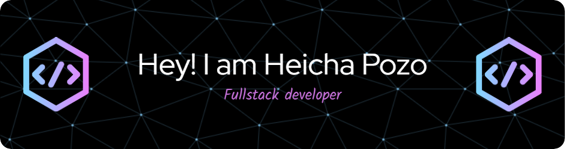

  

Trained in the maintenance, improvement and customization of software systems, with experience in direct interaction with clients to adapt solutions to their needs. Passionate about technology and innovation.

## <b> Skills</b>

##  <b>Statistics<b/>  

